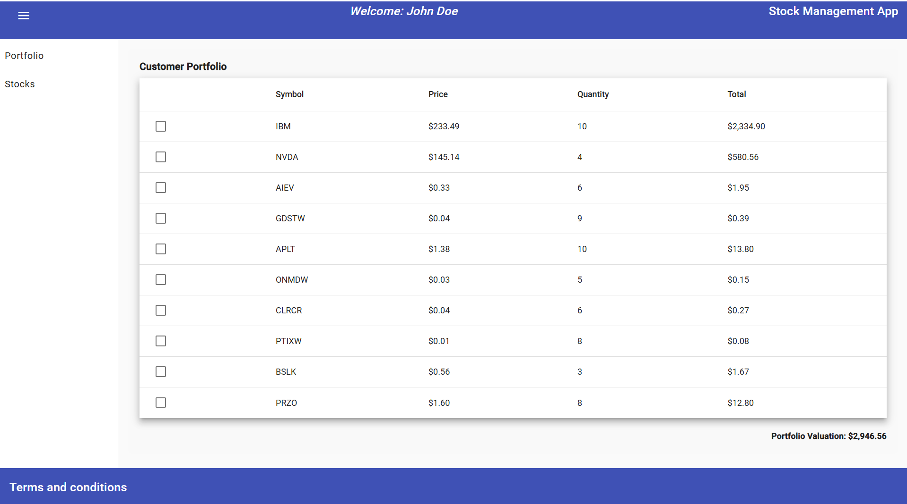
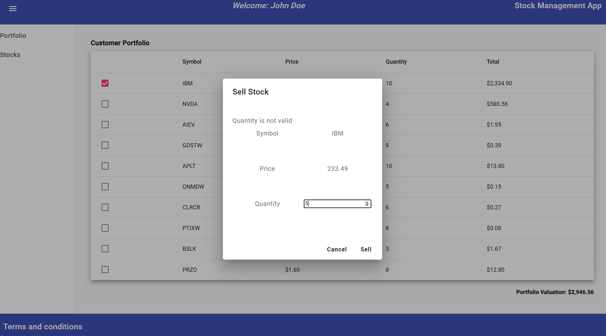
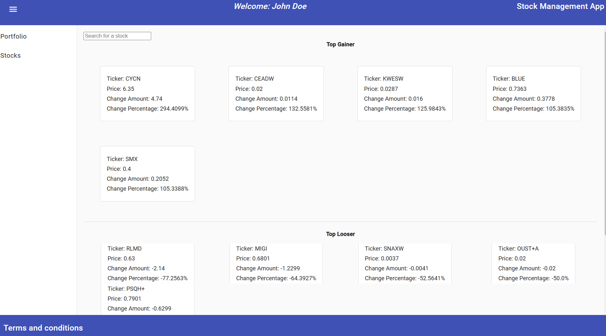
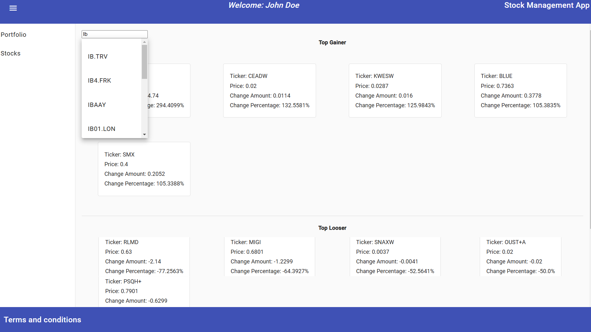
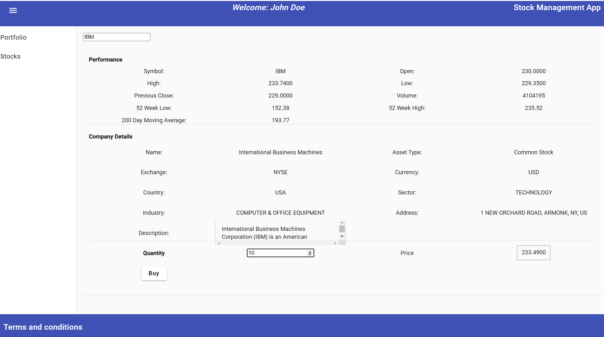

# Stock Management

## Overview

The Stock Management system is designed to efficiently manage the inventory levels of your business. It provides the
ability to add, remove, and update stock items, track inventory changes over time, and generate reports for better
inventory management.

## Features

- Buy new stock items.
- Sell existing stock.
- Remove stock items when they are no longer needed.
- Search Stocks.
- Get Stock details.
- Get Market details

## Technologies

- **Backend**: Java with Spring Boot
- **Frontend**: Angular 17.3.0
- **Database**: H2
- **Server**: Tomcat

## Setup Instructions

1. **Clone the repository:**

   ```bash
   git clone https://github.com/chandresh87/stock-management.git
   cd stock-management
   ```

2. **Install the necessary dependencies for the frontend and backend:**

   For frontend:
   ```bash
   cd stock-portfolio-app 
   npm install
   ```

   For backend:
   ```bash
   cd portfolio-rest-api
   maven cleam package
   Note: Enable annotation processor in IntelliJ otherwise Mapstruct and Lombok will not work.
   ```

3. **Start the development server:**

   For frontend:
   ```bash
   ng serve
   ```

   For backend:
   ```bash
   ./mvnw spring-boot:run
   ```

4. **Access the application:**

   Visit `http://localhost:4200` to access the frontend application.

## Usage

1. **Check UserPortfolio:** Click on the portfolio option. It will fetch all the stock in the portfolio with 
latest price for all the stock. It will also show the total portfolio valuation.

2. **Sell Stock:**
 Select the stock you want to sell and enter the quantity. Quantity should be greater than zero and less than or 
 equal to available stock in Portfolio. 

3. **Check Stock Market News:** Click on stocks Tab.

4. **Search Stocks:** Enter stock symbol and it will search for all the matching names.

5. **Buy Stock:** Select the stock from the search box and enter the right quantity greater than zero.
  you can check additional stock performance and company details on the same page before buying.

## Contact

For any queries, feel free to contact [Chandresh Mishra](mailto: chandresh87@gmail.com).